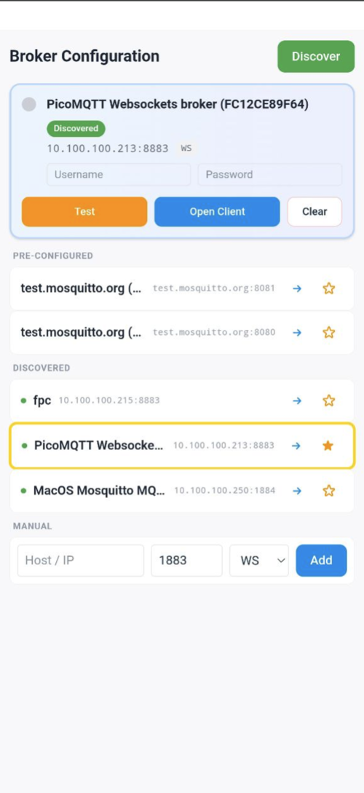
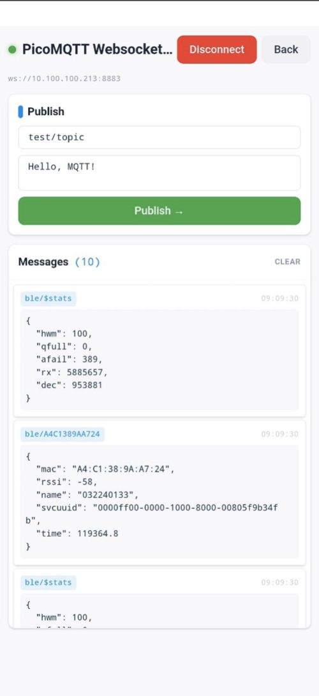

# MQTT mDNS Scanner + MQTT Client using Vue 3 + Capacitor

A cross-platform mobile application built with Vue 3 and Capacitor for discovering and connecting to MQTT brokers. Features a modern, fully responsive UI built with Tailwind CSS v4.

## Features

- 📱 **Cross-platform**: Runs on Android, iOS, and web browsers
- 🔍 **MQTT Broker Discovery**: mDNS/NSD scanning on native platforms
- 🔗 **Broker Management**: Add and manage MQTT brokers manually or via discovery
- 🌐 **Multiple Protocols**: Support for MQTT over TCP, WebSocket, TLS, and WSS
- 💬 **Real-time Messaging**: Subscribe to topics and publish messages
- 📊 **Message History**: View received messages with JSON formatting and timestamps
- 🔧 **Connection Management**: Real-time connection status and error handling
- 📱 **Fully Responsive**: Adapts to all screen sizes with full-width layout
- 🎨 **Modern UI**: Built with Tailwind CSS v4 and semantic Material Design tokens

## Screenshots

### Scanner View
Discover and manage MQTT brokers with mDNS scanning and manual entry.



### MQTT Client View
Connect to brokers and interact with topics in real-time.



## Tech Stack

- **Vue 3** with Options API + `setup()` and TypeScript
- **Capacitor 7.5+** for cross-platform mobile development
- **MQTT.js v5** for MQTT protocol support
- **Vue Router 5** for navigation
- **Vite 7** for fast development and building
- **Tailwind CSS 4** for utility-first styling (no PostCSS required)
- **@mhaberler/capacitor-zeroconf-nsd** for mDNS/NSD discovery (native platforms only)

## Development Setup

### Prerequisites

- Node.js (v18 or higher) / Bun package manager
- Android Studio (for Android development)
- Xcode (for iOS development, macOS only)

### Installation

```bash
# Install dependencies
bun install

# Start development server (Vite on :8102)
bun run dev

# Type-check the project
bun run typecheck

# Build for production
bun run build

# Sync with Capacitor platforms
bun run sync
```

### Mobile Development

```bash
# Run on Android
bun run android

# Run on iOS (macOS only)
bun run ios

# Open in native IDEs
bun run open:android
bun run open:ios

# Debugging with live reload
bun run debug-android-s24    # Or other device targets
bun run debug-ios
```

## Usage

1. **Scanner View**
   - Add MQTT Broker: Enter IP, port, and select protocol type
   - Start Scan: Discover MQTT brokers on your network (native apps only)
   - Tap to Connect: Click on any broker to open the MQTT client

2. **Client View**
   - Connect: Establish connection to the selected broker
   - Subscribe: Automatically subscribes to all topics (#)
   - Publish: Send messages to specific topics
   - Monitor: View real-time received messages in the message history
   - Disconnect: Close the broker connection

## Default Test Brokers

The app includes pre-configured test brokers:
- **test.mosquitto.org (WSS)**: test.mosquitto.org:8081
- **test.mosquitto.org (WS)**: test.mosquitto.org:8080 (native apps only)

## Configuration

### Common MQTT Ports
- **1883**: Standard MQTT over TCP
- **8883**: MQTT over TLS/SSL
- **9001**: MQTT over WebSocket
- **8080**: MQTT over WebSocket (alternate)

### Supported Service Types
- `_mqtt._tcp.`: MQTT over TCP
- `_mqtt-ws._tcp.`: MQTT over WebSocket
- `_mqtts._tcp.`: MQTT over TLS
- `_mqtt-wss._tcp.`: MQTT over WebSocket Secure

## Tailwind CSS v4 Configuration

### Theme Design Tokens

Colors are defined in `src/style.css` using Material Design palette:
- **Primary** (`--color-primary`): #2196F3 (Material Blue)
- **Success** (`--color-success`): #4CAF50 (Material Green)
- **Error** (`--color-error`): #F44336 (Material Red)
- **Warning** (`--color-warning`): #FF9800 (Material Orange)

### Responsive Breakpoints

- **Mobile** (default): Full-width layout with responsive padding (`p-4`)
- **Desktop** (`md:` breakpoint ≥768px): Enhanced layouts with padding increase (`md:p-6`) and multi-column grids (`md:grid-cols-2`)

All components span full window width with no max-width constraints, allowing optimal use of available screen real estate.

### Styling Approach

- **Utility-first**: Tailwind CSS classes inline in Vue templates
- **Semantic classes**: BEM-like button variants (`.btn`, `.btn-primary`, `.btn-success`, `.btn-danger`, `.btn-warning`) using `@apply` directives
- **No scoped CSS**: Pure Tailwind utilities throughout components
- **No PostCSS**: Tailwind v4 via `@tailwindcss/vite` plugin handles all CSS processing

## Architecture

```
src/
├── views/
│   ├── ScannerView.vue           # Broker discovery & management interface
│   │   └── Responsive grid layout with full-width service cards
│   └── MQTTClientView.vue        # MQTT client, messaging, and history
│       └── Full-width responsive layout for messages panel
├── components/
│   └── HelloWorld.vue             # Utility component
├── router/
│   └── index.ts                   # Vue Router configuration
├── types/
│   └── zero-conf.d.ts             # mDNS/NSD plugin type definitions
├── style.css                      # Tailwind v4 + theme tokens + button classes
├── polyfills.ts                   # Node.js compatibility for browsers
├── App.vue                        # Root component
└── main.ts                        # Application entry point

Configuration:
├── vite.config.js                 # Build config with Tailwind plugin + chunk splitting
├── tsconfig.json                  # TypeScript configuration (strict mode enabled)
├── capacitor.config.json          # Capacitor platform configuration
└── package.json                   # Dependencies & scripts
```

## Building for Production

```bash
# Build web assets
bun run build

# Outputs to dist/ with optimized bundles:
# - Separate chunks for mqtt and vue libraries
# - Main app bundle
# - CSS with Tailwind utilities (~19 KB gzipped)

# Sync with mobile platforms
bun run sync

# Generate signed APK/IPA through native IDEs
bun run open:android  # Android Studio
# or
bun run open:ios      # Xcode
```

## Build Optimization

- **Manual chunk splitting**: Separate bundles for `mqtt` and `vue` libraries to reduce main bundle size
- **Chunk size warning limit**: 600 KB (configurable in vite.config.js)
- **CSS output**: ~19.15 KB (gzipped: 4.77 kB)
- **No PostCSS**: Tailwind v4 handles all CSS processing natively via Vite
- **Incremental TypeScript**: `allowJs: true` + `strict: true` for gradual migration support

## Development Guidelines

### Code Style

- **Options API with `setup()`**: Keep `export default { name, setup() { ... } }` format
- **TypeScript**: New code uses `.ts` files; existing JS allowed during migration
- **Vue Components**: Use `<script lang="ts">` with Options API
- **No path aliases**: Use relative imports (`../views/ScannerView.vue`)
- **Styling**: Inline Tailwind utilities; no scoped CSS blocks needed

### Type Checking

```bash
# Run type-checker before commits
bun run typecheck

# Automatically runs in CI on pull requests
```

### Responsive Design

- Mobile-first approach: default styles for small screens, `md:` prefix for desktop
- Use `.w-full` for full-width containers instead of fixed max-widths
- Responsive padding: `p-4` (mobile) → `md:p-6` (desktop)
- Grid layouts: `grid-cols-1` → `md:grid-cols-2` for multi-column on desktop

## Contributing

1. Fork the repository
2. Create a feature branch (`git checkout -b feature/your-feature`)
3. Make your changes (follow code style guidelines above)
4. Run `bun run typecheck` to validate TypeScript
5. Test on both web and mobile platforms
6. Submit a pull request

## License

MIT License - see LICENSE file for details
